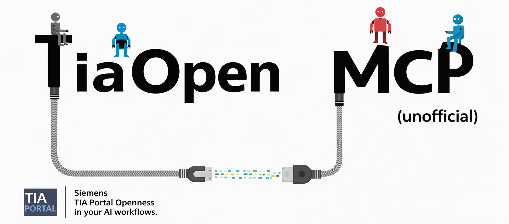

# TiaOpen MCP

[](LICENSE)
[](package.json)
[](#prerequisites)
[](https://modelcontextprotocol.io)
[](#what-it-does)

Build, inspect, organize, and import Siemens TIA Portal PLC + HMI content from any MCP-aware AI client.

---

## What it does

An MCP server that wraps Siemens TIA Portal Openness so an AI assistant can work directly against an open TIA Portal project: list blocks and PLC data types, inspect XML, import raw XML or plain SCL, compile the PLC software, manage tag tables, create DBs, organize block and type groups, and generate LAD blocks from structured JSON. Companion HMI patterns (WinCC Unified) are documented in [`docs/hmi-unified-reference.md`](docs/hmi-unified-reference.md) for screen automation in PowerShell.

Unofficial. Not affiliated with Siemens.

## Documentation

| Doc | Use it for |
|---|---|
| [`docs/overview.md`](docs/overview.md) | High-level architecture and tool wiring |
| [`docs/openness-patterns.md`](docs/openness-patterns.md) | Verified PowerShell patterns: attach, walk device tree, compile, import/export |
| [`docs/hmi-unified-reference.md`](docs/hmi-unified-reference.md) | WinCC Unified screen automation -- types, tags, screens, dynamizations, the widget-direction rule (§13), layout-aware design pattern (§14), copy-paste bind recipes (§15) |
| [`docs/tia-v20-instructions.md`](docs/tia-v20-instructions.md) | Bundled TIA V20 instruction reference (used by `lookup_instruction`) |
| [`docs/instruction-coverage.md`](docs/instruction-coverage.md) | Which instructions have verified XML templates |
| [`docs/environment-readiness.md`](docs/environment-readiness.md) | Pre-flight checklist before first run |
| [`docs/testing-log.md`](docs/testing-log.md) | Historical test results during tool bring-up |
| **[`docs/lessons-learned.md`](docs/lessons-learned.md)** | **47 lessons from real failures -- read this before debugging anything weird.** Covers Openness security, XML structure (LAD/SCL), HMI Unified quirks (widget selection, MappingTable, encoding gotchas, layout invariants, surgical post-edits) |
| **[`docs/kistler-example/`](docs/kistler-example/)** | **Full worked example.** Complete domain reference (`kistler-reference.md`, 1473 lines: device protocol, FB anatomy 51 networks, UDT bit map FB-verified, supervision, faceplate notes, build recipe) + the layout-aware design framework (`scripts/kistler-design.ps1`) + the build script that produced a working 204-item screen + the FB-XML bit-map extractor (`extract_bit_map.py`) + the standalone layout test suite. Nothing summarised -- verbatim sources for the canonical Kistler maXYmos NC HMI build. |

## Prerequisites

| Software | Version |
| --- | --- |
| Windows | 10 or 11 |
| TIA Portal | V20 Update 4 with an open project in the UI |
| Node.js | 18 or newer |
| MCP client | VS Code + Copilot, Cursor, Claude Desktop, or another MCP-aware client |
| PowerShell | Windows PowerShell 5.1 or newer |

## Install

```powershell
git clone https://github.com/eponce-amperesand/tiaopen-mcp.git
cd tiaopen-mcp
npm install
```

### Manual registration

If you want to register it yourself instead of relying on workspace config, point your MCP client at `src/index.js`.

**VS Code (global):**

```powershell
code --add-mcp '{"name":"tiaopen","type":"stdio","command":"node","args":["C:/path/to/tiaopen-mcp/src/index.js"]}'
```

**Cursor (global)** add to `~/.cursor/mcp.json`:

```json
{
  "mcpServers": {
    "tiaopen": {
      "command": "node",
      "args": ["C:/path/to/tiaopen-mcp/src/index.js"]
    }
  }
}
```

This repo also includes a ready-to-use `.vscode/mcp.json` entry for workspace-local use.

Restart the MCP client after changes under `src/`.

## Project selection

This server talks to an already-open TIA Portal UI session. Most scripts attach to the first UI process whose window title matches `Testing_Playground`, then fall back to the first open project in that session.

If your project name is different, use the `project_match` or `ProjectMatch` parameter where supported.

## How it works

The Node MCP server exposes typed tool schemas with Zod and dispatches each tool to a PowerShell script in `scripts/`.

- TIA Portal must already be running with the target project open.
- XML import and export flows are done through TIA Openness.
- SCL import goes through `ExternalSource` generation, then optional compile.
- Most mutating tools append a compile or save nudge when the operation succeeds.
- `preflight_scl` catches the two failure modes that waste the most time in TIA import flows: non-ASCII text and reserved-keyword identifier collisions.

## Tools

| Tool | What it does |
| --- | --- |
| `list_blocks` | List all PLC blocks recursively, including type, language, number, consistency, and group path. |
| `list_data_types` | List PLC data types recursively, including consistency and group path. |
| `list_tag_tables` | List PLC tag tables and tag-table groups, including the default tag table. |
| `tia_status` | Report TIA Portal process health, attachability, window titles, and open projects. |
| `save_project` | Save the currently open TIA project to disk. |
| `list_groups` | List both Program Blocks groups and PLC data type groups. |
| `ensure_library_layout` | Apply or dry-run a manifest-driven group layout for blocks and PLC data types. |
| `get_block_xml` | Export a PLC block as raw TIA XML. |
| `write_block` | Import a raw XML block file into TIA and optionally compile it. |
| `write_scl_block` | Import a plain `.scl` file as an external source, generate block(s), optionally compile, and optionally place them into groups. |
| `preflight_scl` | Run static checks on an SCL file before import. |
| `create_group` | Create a Program Blocks group path, including missing parents. |
| `create_type_group` | Create a PLC data types group path, including missing parents. |
| `move_block_to_group` | Move an existing block into a Program Blocks group. |
| `move_type_to_group` | Move an existing PLC data type into a PLC data types group. |
| `compile` | Compile the PLC software and return error and warning messages. |
| `list_tags` | List PLC tags across the default and user-defined tag tables. |
| `create_tag` | Add a tag to the default or a named tag table. |
| `list_templates` | List available XML templates with purpose and token placeholders. |
| `create_block` | Render a verified XML template, import it, and compile it. |
| `build_lad_block` | Generate and import a LAD FC, FB, or OB from a structured JSON flow description. |
| `delete_item` | Delete a named PLC block or PLC data type. |
| `preview_block` | Render a template to XML without importing it into TIA. |
| `get_template_xml` | Return the raw unresolved XML for a template. |
| `create_tag_table` | Create a user-defined PLC tag table. |
| `create_global_db` | Create a new empty global DB. |
| `create_instance_db` | Create an instance DB for a user-defined FB. |
| `lookup_instruction` | Search the bundled TIA V20 instruction reference. |

## Example prompts

```text
List all PLC blocks in the open TIA project
Show me the XML for FB_KistlerNC
Preflight this SCL file before import
Import UDT_KistlerNC_Cmd.scl into the Kistler NC type group
Create a Program Blocks group called Kistler NC/Helpers
Move FB_KistlerNC into Kistler NC
Create a LAD block that turns on %Q0.0 when %I0.0 is true
Compile the PLC software and show me the errors
Add a Bool tag called StartButton at %I0.0
Find the TIA documentation entry for TON
```

## Troubleshooting

**Server does not start.** In VS Code, run `MCP: List Servers`, then start and trust the server. In Cursor, enable the MCP server in settings.

**No TIA process matching the project was found.** Open the project in the TIA Portal UI first, or pass a `project_match` value that matches the window title or project name.

**SCL import fails with strange identifier or tag-definition errors.** Run `preflight_scl` first. This repo intentionally blocks or warns on reserved identifiers and non-ASCII text because TIA Openness reports those failures poorly.

**XML import fails silently or compiles with schema-style errors.** Compare against `get_template_xml` or `get_block_xml` output from a known-good block. Namespace mismatches, unsupported XML comments inside network object lists, and wrong address encoding are common causes.

**Changes worked in memory but are not on disk.** Call `save_project` after successful mutations. TIA keeps edits in the live UI session until the project is saved.

## Contributing

Issues and PRs welcome. Before opening a PR:

1. Skim [`docs/lessons-learned.md`](docs/lessons-learned.md) -- new findings should be appended there as the next numbered entry following the existing **What happened / Root cause / Fix** format.
2. If you add a new tool to `src/tools.js`, also add a row to the **Tools** table in this README.
3. For HMI changes, cross-link to [`docs/hmi-unified-reference.md`](docs/hmi-unified-reference.md).
4. For PLC XML changes, validate against the official XSD schemas under `C:\Program Files\Siemens\Automation\Portal V20\PublicAPI\V20\Schemas\` (see lesson 14).

## License

MIT. See `LICENSE`.
